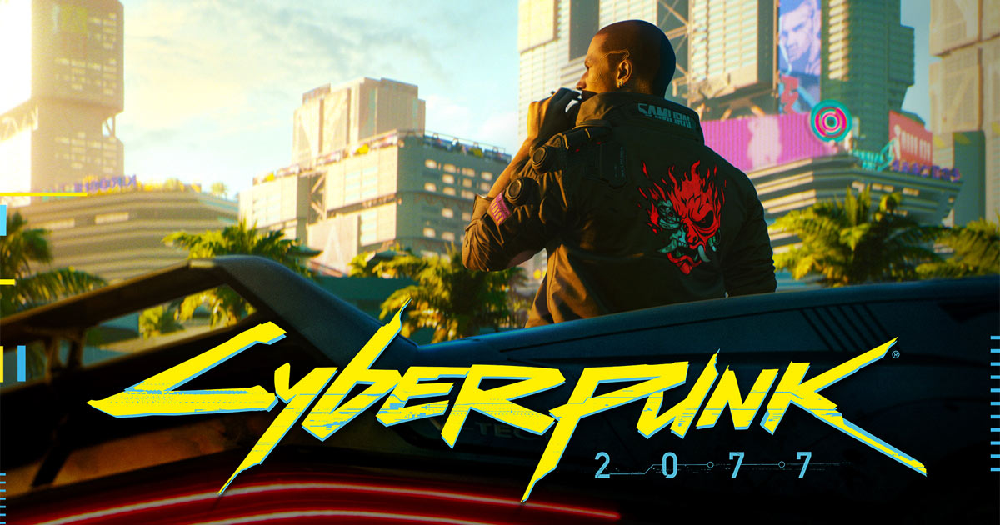
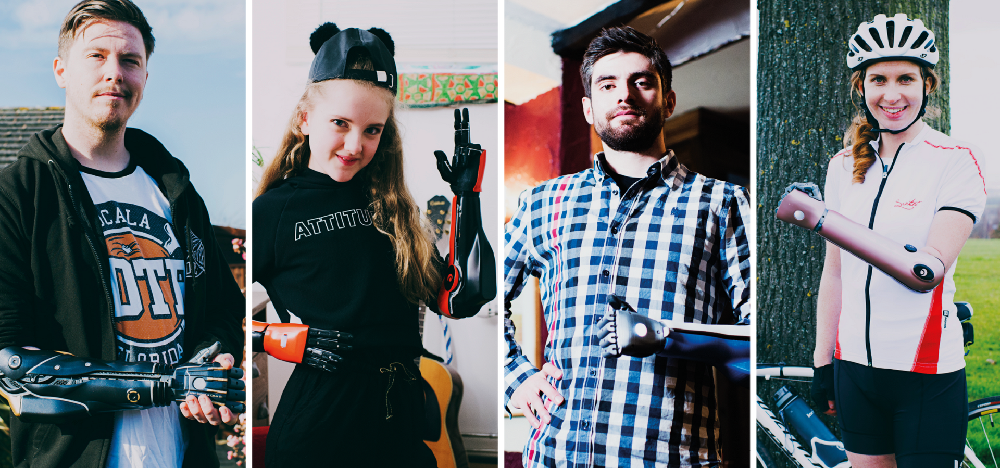
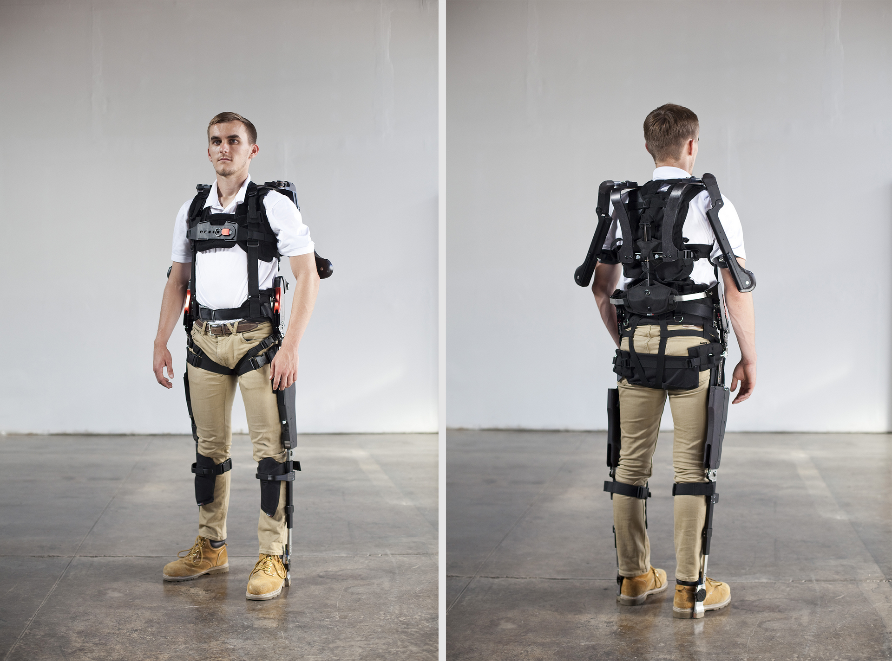
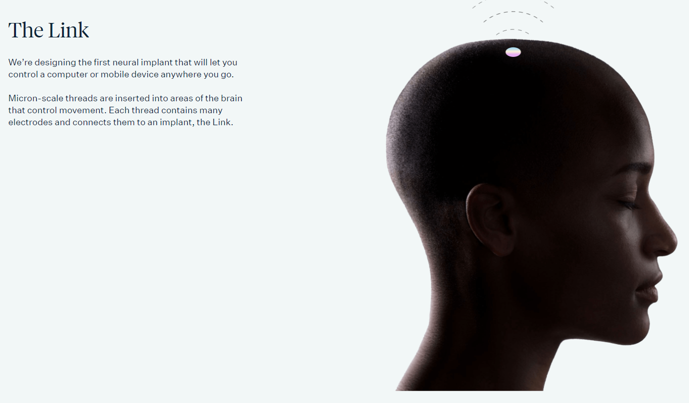
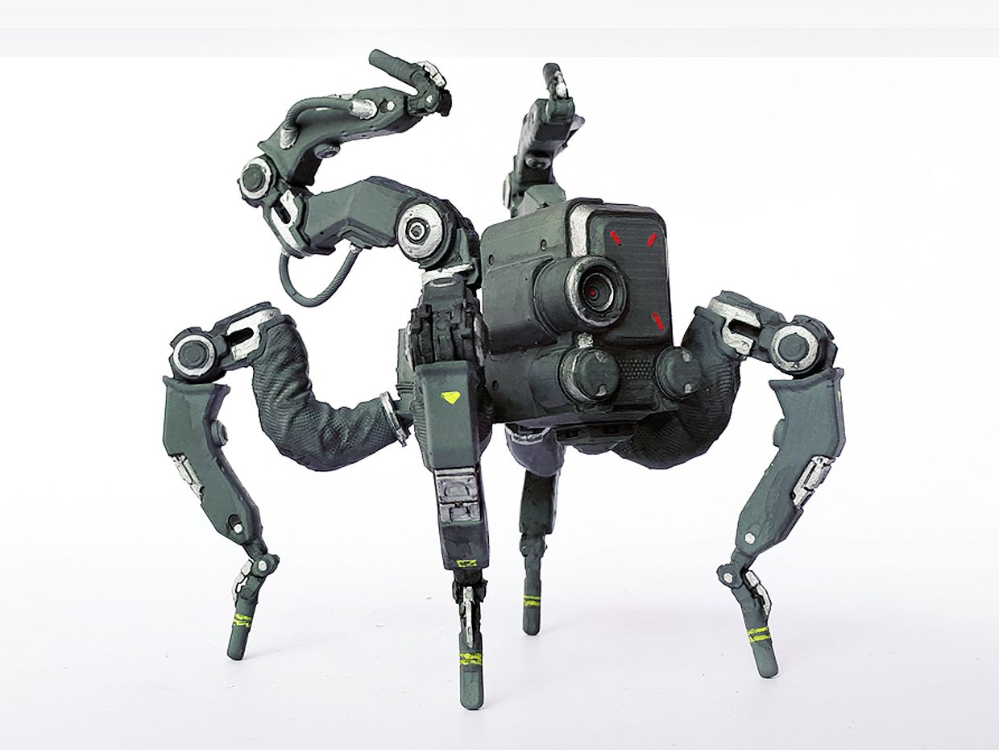
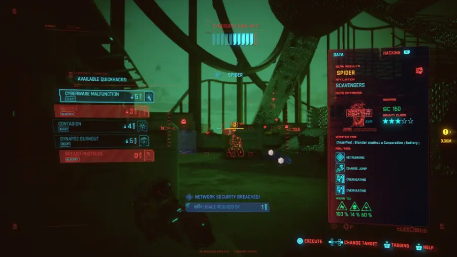
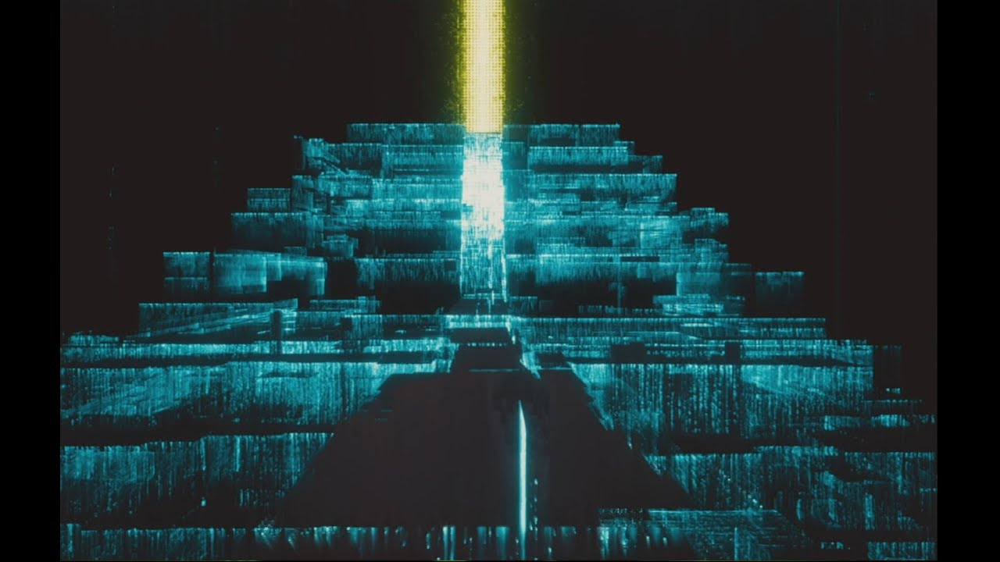

最近最火热的话题莫过于游戏《赛博朋克2077》了，我本身是一个游戏迷，对于这款充满未来元素与机器科技的游戏就更加期待了。这两天，我不断收到知友们关于“赛博朋克中的科技到底离我们还有多远？”问题的邀请，借由此机会我想对赛博朋克世界中的内容 --- 主要是科技元素的可行性 --- 进行一些讨论。赛博朋克世界中的主要科技元素基本相似，以下就围绕在《赛博朋克2077》游戏中出现的元素进行讨论。

## 1. 什么是赛博朋克？

赛博朋克的英文：Cyberpunk，即Cyber + Punk. Cyber来自于控制论Cybernetics，而Punk来自于朋克文化。赛博朋克是一种“悲观主义反乌托邦式”的虚构世界，描述一种高科技低生活的未来世界，不仅社会秩序受到严格控制，身体和心灵上也受到了虚拟世界的侵蚀，无法明确对虚拟世界和现实世界的边界。与赛博朋克相关的有大量文学、影视和游戏作品，其中1983年的《Cyperpunk》小说被视为赛博朋克文学的代表，其中不乏对《仿生人会梦见电子羊吗》一书中“机器亦有精神”的思想进行了延续。在影视作品中，也有我们熟知的《银翼杀手2049》以及《攻壳机动队》。其中《银翼杀手2049》将赛博朋克的世界以视觉的方式展现给了我们。电影中展现了一个充满科技感却十分冰冷的未来世界。而《攻壳机动队》中（主要指动画），更是将这一问题提升到了哲学高度，即机器有灵魂吗？这其中还有很多值得讨论的问题，但是再讨论下去好像有点偏题，留到下次再说。

## 2. 赛博朋克中的主要技术剖析

在《赛博朋克2077》中，在我的游玩体验过程中，主要观察到了到了以下“黑科技”：

- 义肢/仿生人
- 机器人
- AR与VR
- 实时语音识别与转换技术
- 全息投影技术
- 记忆移植技术
- 智能追踪武器
- 强大的AI与计算机网络

以下从中挑选出几个我觉得有意思的点讨论一下可行性。

### 2.1.义肢/仿生人
义肢的核心技术并不是机械，而是机械如何与人进行结合，成为“仿生人 (Cyborg)”。仿生人具有异于常人的能力，可以通过义眼获得更好的视觉系统，义腿获得更好的速度和弹跳力，甚至可以扩充记忆能力以及获得连接互联网数据的能力。

义肢的核心技术就是如何使人和大脑相连接，这点需要依赖大脑科学和认知神经科学。目前state-of-the-art已经可以“读取”大脑的基本指令，实现义手的控制，并且已经可以达到非常可观的精度：

▲ Open Biotics研发的机械手义肢 ▲

在军工领域，也已经有了体外骨骼，为士兵提供更强的能力。当然他们的原理并非阅读大脑信号，而是将操作者的行为进行了放大：

▲ 体外骨骼 ▲

然而真正做的赛博朋克中的仿生人，我们不仅需要读取大脑的信息，还需要可以“写入”。比如义眼需要可以修改人的视觉信号，刺激相应的神经，“仿真”出和人眼一样的信号从而“欺骗”大脑。在这个领域，Elon Musk的脑机接口Neruallink (https://neuralink.com/) 被视为这个方向的代表。

▲ Neruallink脑机接口概念图 ▲

目前在脑机接口领域的研究很有限，主要还是以在鼠类/猴类上进行简单行为为主。因为“写入”可能会反向损伤大脑，研究的难度比“读取”大很多，所以进展缓慢。期待这方面在未来的十年会有小突破。然而要完全实现脑机交互，十年是不够的，可能需要20-50年，离我们现在的生活还比较远。

### 2.2. 机器人
在《赛博朋克2077》中出现的机器人以传统的机器人形象为主，依然是冰冷的机器，而没有刻意像《底特律：变人》中一样强调机器也有可能有情感。我想这是因为赛博朋克世界中更想强调“人越来越像机器”而不是“机器越来越像人”。在赛博朋克游戏中出现的最先进的机器人应该是主线任务中Militech的这款Spider Bot：

▲ Spider Bot by Militech in Cyberpunk 2077 ▲

游戏中主要展现了它全地形攀爬以及具有光学隐形能力。对于全地形攀爬（包括附着在天花板上），应该可以通过磁力吸附，相关技术我在2014年的时候研究过，但是这里的难点是它的吸附着力点面积很小。解决方法是：增大磁场生成功率的同时要减轻自重。这点只能通过提高能量密度实现，即需要更好的动力系统。

至于光学涂装，简单一点说就是将周围的环境捕捉，并投射到自身的表面从而从视觉上进行欺骗，让观察者无法注意。这里的难点是机器人并非规则物体，而投射面又需要与表面正交，简单的方法是将投射面进行扩充，在自身周围形成一个规则立方体光学面（结合全息投影技术）。

另一点让我很感兴趣的就是这个机器人还具有极好的灵活性和动态性能，未来一定可以在工厂或军事中得到应用。看到波士顿动力近十年来的发展，我觉得这个机器人总体上（除了光学涂装外）可行。一旦我们在便携式能源技术上有突破，我们就可以有更多的想象空间。

### 2.3. AR与VR
赛博朋克中的另一个元素就是AR和VR。AR的场景即是V可以通过义眼的扫描增强功能，读取周围物体和人物的信息。这一点结合图像识别和5G网络，在现如今已经可以小规模实现。然而想要大规模实现，需要有完善的数据库、图像语义识别能力、高速的移动网络，其中也涉及了一些隐私数据的保护等伦理问题。

▲ 2077中的扫描功能 ▲

游戏中的另一个元素是VR，这一点就是很多人沉迷于一种叫“超梦/BD”的技术。超梦是一种将别人的经历（包括感官上的）录制下来，之后播放者可以复现的一种技术。严格意义上来说，超梦并不是VR，而是一种5D电影，在传统3D的基础上，增加了视觉和感官。它既是一种类似电影的沉浸式体验，也因为体验者有“我即是电影中主角的错觉”从而产生了与传统电影完全不同的体验。这一点上，实现的主要技术依然是人脑接口技术，因为要将人的感官复现，必须要能读取到人诸如嗅觉、视觉、触觉等感官的信号。以此为基础的话，录制和播放本身就和我们现在录短片、看短片一样。

▲ 使用超梦需要使用专用的接入设备 ▲

AR与VR技术在推广中受到了很大的阻挠，其原因还是因为设备无法小型化/技术不成熟/使用场景模糊。然而比起目前的实现方式来说，它们之后更多的会隐藏在我们每一个设备中，无处不在，你却不再感受得到它们。比如在你的汽车挡风玻璃上，在你的镜子里。虽然我们现在总是把这两个技术放在一起来说，但对比两个技术，AR有更多的“实用”因素，它强调扩展信息，而VR更强调的是“体验”，这也决定了它们之后会有截然不同的技术道路。

### 2.4. 强大的AI与计算机网络
以上几乎所以技术都依赖于强大的AI辅助以及有复杂的计算机网路作为支撑。游戏中一个很重要的元素就是你可以进入Cyber-space. 在赛博朋克的世界里，cyber-space是一个比物理世界更宏大的存在。黑客们在其中找到生活的空间，人也可以逃避现实生活的无情，而沉浸在虚拟的网络世界中。这一点在很多科幻电影中已经都有体现，如Ready Player One/头号玩家。AI一定程度上帮助了我们工作和生活，另一个程度上又让我们产生了过强的依赖性，以至于离开它们我们就无法继续生活下去了。在赛博朋克的世界中，就出现了逃离这种生活的反抗者，他们寻求自我，摆脱高科技的奴役。

▲ 2077中的Cyber-space ▲

然而，游戏中表现的这种场景离我们甚远，是科技发展到一定阶段所会带来的社会问题。目前我们的阶段还处在非常初期的阶段，我们看见了深度学习在一些领域上崭露头角，尤其是DeepMind、OpenAI、Tesla和国内的腾讯、阿里、百度等公司的成果。但是想要让AI更加渗入进生活的方方面面，还需要研究和开发人员的不懈努力。AI的发展（以及一切科技）都是螺旋中上升的，我们需要静观其变，给予它们充分的时间去发展。同时，我们也要谨记科技不是用来作恶的。我们在技术发展的过程中，一定要把握好这把双刃剑，需要约法三章，避免科技得到滥用（如智能摄像头、匿名身份识别、点对点武器打击）。

## 3. 结论
当然以上讨论的这些都只是赛博朋克世界观的表面，Cyberpunk更多的需要从人文和社科的角度上去看待。我们期待一个像赛博朋克一样的“High Tech”高科技生活，但不希望看见这个世界最终变成绝大部分人的“Low Life”。这就需要我们不断的在技术和自我之间寻求一个平衡，也需要我们合理发展科技，以“科技服务于人”为宗旨。
