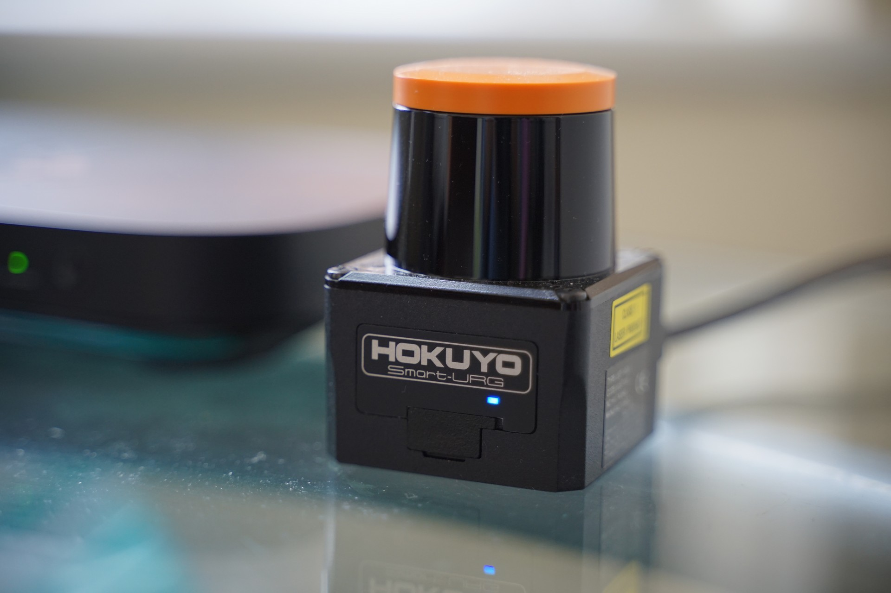
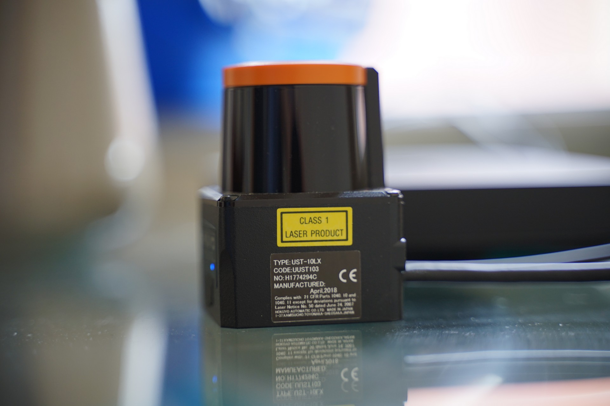
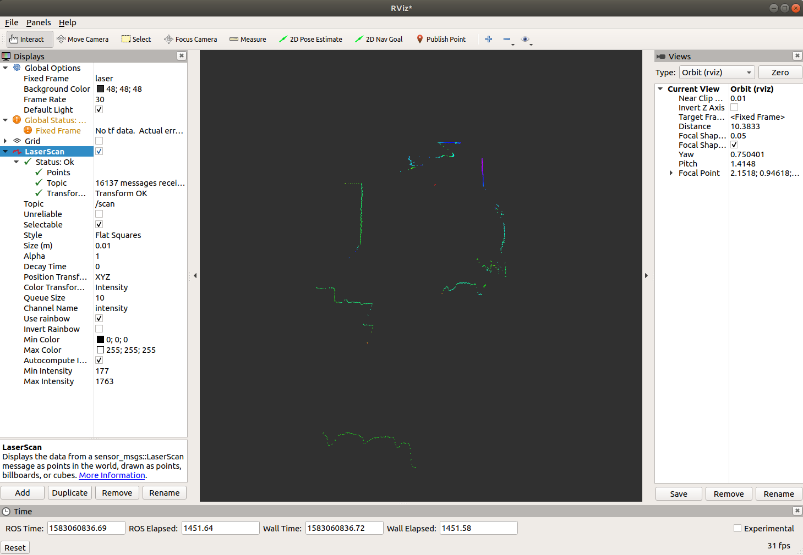

# 在ROS 2中使用单线激光雷达 (HOKUYO UST-10LX)

## 1. 单线激光雷达简介

单线激光雷达 (LiDAR) 多用于移动机器人领域，帮助机器人规避障碍物。单线雷达速度快、分辨率高、响应时间短，相对多线雷达具有更好的角频率响应和精度。缺点是单线雷达只能扫描二维平面，不含位置信息。主流的单线激光雷达品牌有国外的SICK和HOKUYO，也有国内自主品牌思岚科技SLAMTEC，按连接方式分为USB和网口两种。不同于多线雷达动辄万元美元的价格，单线雷达的价格相对低很多，几千元至几万元就可以买到性能不错的单线雷达。单线雷达在机器人领域主流的应用场景有：AGV、安全区域扫描、扫地机器人、送餐及服务机器人等。虽然在高校实验室中已经被大量使用，目前网上能找到的单线激光雷达资料不多，但随着服务机器人的发展，这方面的需求又有了很大的增长。今天我就以一款激光雷达（UST-10LX）为例，介绍单线激光雷达在ROS 2中的使用。


## 2. HOKUYO UST-10LX

HOKUYO UST-10LX是基于网口的单线激光雷达 (HOKUYO是日本本土最大的激光雷达厂商)。UST-10LX价格相对较低（1360欧），不过对个人来说还是价格非常偏高的传感器了。HOKUYO UST-10LX激光雷达的主要参数如下：

| 参数           | 参数数据及说明         |
| -------------- | ---------------------- |
| 电源及功耗     | 12v或24v直流，150mA    |
| 检测距离       | 0.06 - 10m（30m最大）  |
| 精度           | 误差40mm               |
| 扫描角度       | 270°                   |
| 角度分辨率     | 0.25°                  |
| 测量频率       | 40Hz（25ms @ 2400rpm） |
| 波长           | 905nm                  |
| 每周期扫描点数 | 1081                   |
| 重量           | 130g                   |

看一个激光雷达的参数，主要看扫描频率（40Hz），扫描范围（270度），最大测距距离（10m）以及单圈点数（1081）。机器人运动速度越快，需要对应的扫描频率就越高；而需要的精度越高，障碍物的体积越小，也就需要越高的单圈点数。一般来说还会考量抗光线干扰的能力，不过一般没有具体的量化指标，只能在实际场地测试。



▲ 图1. UST-10LX激光雷达正面



▲ 图2. UST-10LX激光雷达侧面


**物理连接方式:** UST-10LX有两组线：一组网线，一组信号线。网线长度较短，插在路由器或机器人主控机上。信号线分为电源、同步信号（输出）及网络复位信号（输入）：电源需要12或24v直流，信号和复位根据需要选接。信号线的引脚定义在说明书中有介绍，在此不再赘述。通电后，机身蓝色LED会点亮，同时靠近可以听见微弱的旋转声。上电后就会自动向外发送数据，此时观察RJ45口数据通信灯会闪烁。

**网络地址设置:** UST-10LX的默认IP地址为192.168.0.10 (端口port: 10940)。使用时要保证PC和激光雷达在同一个网段，如果有通过路由器连接，则需要把路由器配置为192.168.0.x. 设置好后ping一下确认网络通畅：`ping 192.168.0.10`。

---

## 3. 在ROS 2中使用

ROS 2相对比较新 (我使用的是dashing)，目前还没现成的urg_node驱动，需要从源码进行安装。这个过程花了我比较长的时间，主要是驱动程序使用ament编译工具链，而非debian自带的colcon，需要下载ros2源码编译ament。如果不是dashing版本应该不会有这个问题，之后应该会有针对dashing的发布版（以下所有命令注意将ros的安装地址和workspace的地址换为你对应的文件夹位置）。

### 3.1 下载及编译驱动

驱动的GitHub地址为：https://github.com/ros-drivers/urg_node ，需要将branch切换为ros2-devel

```
# make folder and init
mkdir -p ~/ros2-ws/src
cd ~/ros2-ws/src
source /opt/ros/dashing/setup.bash

# clone git repository
git clone https://github.com/ros-drivers/urg_node

# checkout对应的版本
git checkout ros2-devel
```

urg_node存在以下依赖关系:

```
repositories:
  urg_node_msgs:
    type: git
    url: https://github.com/ros-drivers/urg_node_msgs.git
    version: master
  urg_c:
    type: git
    url: https://github.com/ros-drivers/urg_c.git
    version: ros2-devel
  laser_proc:
    type: git
    url: https://github.com/ros-perception/laser_proc.git
    version: ros2-devel
```

通过以下命令对工程进行编译：
```
# 解决依赖
vcs import src < src/urg_node/additional_repos.repos
sudo apt-get install ros-dashing-diagnostic-updater

# 开始编译
colcon build --symlink-install
```


### 3.2 连接ROS 2

首先初始化ROS环境：`source install/local_setup.bash`

然后运行urg_node驱动：
```
ros2 run urg_node urg_node_driver __params:=~/ros2_ws/src/urg_node/launch/urg_node_ethernet.yaml
```

之后就可以显示节点信息了：

```
# 显示节点信息
ros2 node info /urg_node

# 获得device ID
ros2 run urg_node getID 192.168.0.10:10940

# 显示sensor_msg
ros2 msg show sensor_msgs/LaserScan

# echo the topic
ros2 topic echo /scan
```

最后也可以打开rviz，查看数据：

```
ros2 run rviz2 rviz2
```





▲ 图3. 在rviz中查看激光雷达数据


## 4. 小结

这篇文章介绍了HOKUYO的UST-10LX单线激光雷达，并且初步介绍了其在ROS 2中的使用方法。之前我也使用过RPLIDAR A1激光雷达结合ROS和Hector Mapping试验过SLAM，视频在B站上可以找到：https://www.bilibili.com/video/BV1i741137gG 。我计划的下一步工作是介绍如何在移动机器人上通过低成本激光雷达，进行简单的避障与路径规划，实现相比超声波传感器更加准确的运动控制。
